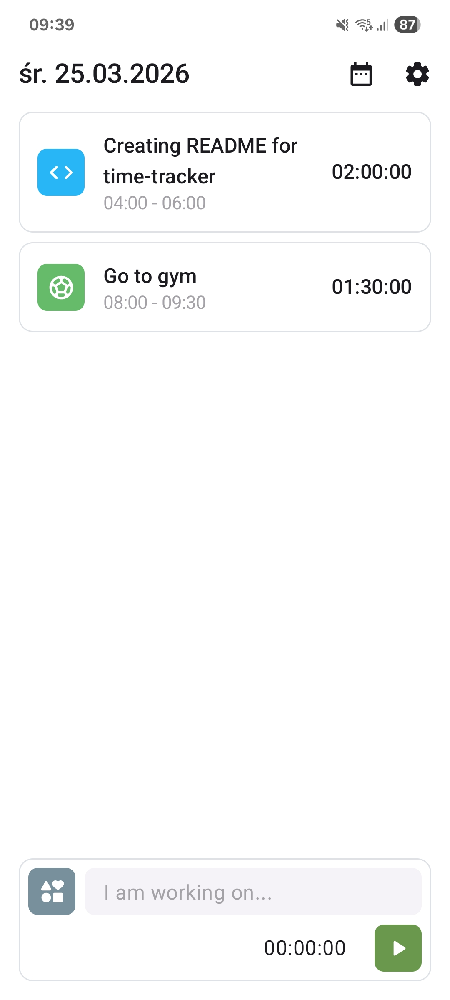
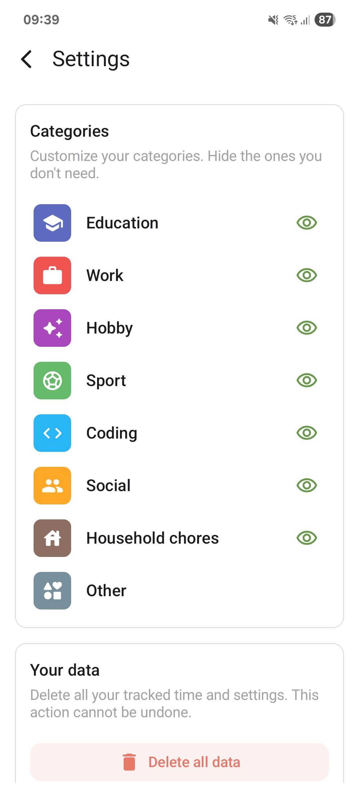

# TimeTracker

A minimalistic Android time tracking app built with Kotlin and Jetpack Compose. Start and stop a timer to log your activities, browse entries by day, and organize everything with customizable categories.

## Demo & Screenshots

<p align="center">
  
  &nbsp;&nbsp;&nbsp;
  
  &nbsp;&nbsp;&nbsp;
  
</p>

## Features

* **Start & Stop Timer:** Tap to begin tracking, tap again to save the entry with its duration automatically calculated.
* **Category Assignment:** Each entry is assigned to a category, making it easy to see where your time goes.
* **Browse by Day:** Navigate between days to review past entries and their durations.
* **Category Management:** Disable categories you don't need or re-enable them at any time from settings.
* **Clear Data:** Wipe all saved entries directly from the settings screen.

## Tech stack

| Layer | Technology |
|-------|------------|
| Language | **Kotlin** |
| UI | **Jetpack Compose + Material 3** |
| Navigation | **Navigation Compose** |
| Persistence | **Room** |
| DI | **Koin** |

## Build & Run

1. Clone the repository

```
git clone https://github.com/iEranDEV/time-tracker.git
```

2. Open in Android Studio and sync Gradle

3. Run on an emulator or connected device

```
./gradlew installDebug
```
